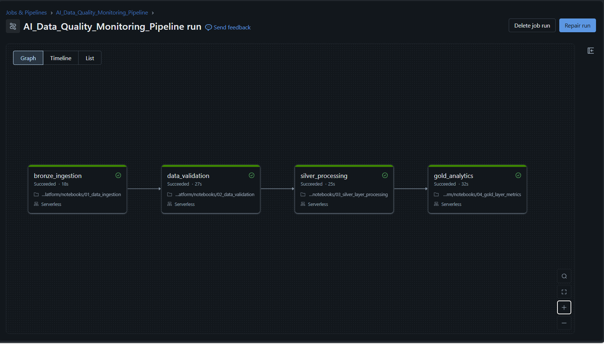
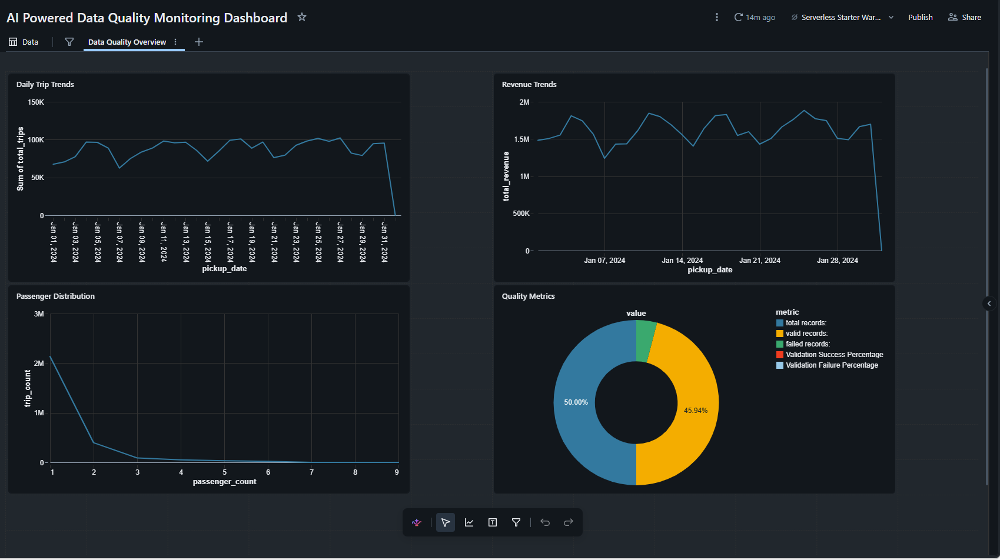
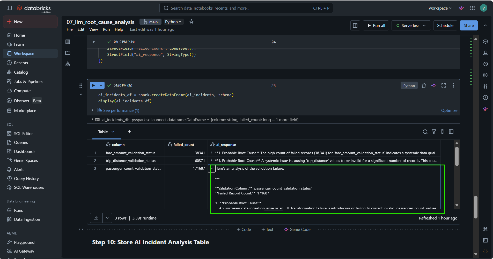

# AI Powered Autonomous Data Reliability Platform

## Project Overview

The AI Powered Autonomous Data Reliability Platform is an enterprise-grade data quality and observability solution built using PySpark, Databricks, Delta Lake, and Gemini LLM integration.

This platform is designed to monitor large-scale data pipelines, dynamically validate incoming datasets, detect anomalies, identify schema drift, detect null spikes and duplicate records, and generate AI-powered root cause analysis for intelligent incident monitoring.

The project uses a Medallion Architecture (Bronze, Silver, Gold) along with a metadata-driven validation framework to build scalable and reusable data quality pipelines.

---

# Problem Statement

Modern enterprise data pipelines process massive volumes of data daily. Poor data quality can lead to:

* Incorrect business reporting
* Revenue calculation issues
* Downstream analytical failures
* Broken machine learning pipelines
* Increased operational risks

Traditional monitoring systems rely heavily on manual validation logic and static rules, making them difficult to scale and maintain.

This project solves these challenges by combining:

* Metadata-driven validation
* Dynamic rule execution
* AI-powered incident analysis
* Intelligent observability

---

# Solution Architecture

```text
Raw NYC Taxi Data
        ↓
Bronze Layer (Raw Ingestion)
        ↓
Metadata Validation Framework
        ↓
Dynamic Validation Engine
        ↓
Silver Layer (Validated Data)
        ↓
Gold Metrics Layer
        ↓
Gemini LLM Root Cause Analysis
        ↓
Dashboards & Monitoring
        ↓
Workflow Orchestration
```

---

# Medallion Architecture

## Bronze Layer

* Raw data ingestion
* Stores original NYC taxi dataset
* Initial landing zone for pipeline processing

## Silver Layer

* Data cleansing and transformation
* Dynamic validation execution
* Invalid record filtering
* Standardization and schema enforcement

## Gold Layer

* Aggregated business metrics
* Quality monitoring metrics
* AI-generated incident analysis
* Dashboard-ready analytical tables

---

# Key Features

* Metadata-driven validation framework
* Dynamic validation execution engine
* AI-powered root cause analysis using Gemini LLM
* Medallion architecture implementation
* Intelligent incident monitoring
* Automated validation summary generation
* Workflow orchestration using Databricks Workflows
* Interactive dashboards using Databricks Dashboards
* Delta Lake integration
* Scalable PySpark data processing
* Enterprise-style observability framework
* AI-generated remediation recommendations

---

# AI Powered Root Cause Analysis

This project integrates Google's Gemini LLM to generate intelligent incident analysis dynamically.

The AI engine analyzes:

* validation failures
* anomaly patterns
* failed record counts
* schema inconsistencies

It then generates:

* probable root cause
* business impact
* severity level
* remediation recommendations

Example AI Output:

```text
Root Cause:
A high volume of invalid fare values indicates possible upstream schema inconsistencies or malformed ingestion records.

Business Impact:
Incorrect revenue calculations and downstream analytical inconsistencies may occur.

Severity:
HIGH

Recommended Resolution:
Validate source schema mappings and quarantine malformed fare records for further analysis.
```

---

# Dynamic Validation Framework

The platform uses a metadata-driven architecture where validation rules are stored separately from business logic.

This allows:

* scalable rule management
* reusable validation logic
* easier maintenance
* dynamic rule execution
* enterprise-level extensibility

New validation rules can be added without modifying core pipeline code.

---

# Workflow Orchestration

The platform uses Databricks Workflows to orchestrate the complete pipeline:

1. Bronze Data Ingestion
2. Validation Processing
3. Silver Layer Transformation
4. Gold Metrics Generation
5. AI Root Cause Analysis

The workflow DAG enables automated and scalable execution.

---

# Dashboards & Monitoring

Interactive dashboards provide:

* daily trip trends
* revenue monitoring
* passenger distribution analysis
* validation metrics
* AI-generated incident summaries

These dashboards improve platform observability and monitoring capabilities.

---

# Tech Stack

| Technology            | Purpose                      |
| --------------------- | ---------------------------- |
| PySpark               | Distributed data processing  |
| Databricks            | Data engineering platform    |
| Delta Lake            | Reliable storage layer       |
| SQL                   | Analytical querying          |
| Gemini API            | AI-powered RCA               |
| GitHub                | Version control              |
| Databricks Workflows  | Pipeline orchestration       |
| Databricks Dashboards | Visualization and monitoring |

---

# Repository Structure

```text
ai-data-quality-monitoring-platform/
│
├── notebooks/
│   ├── 01_data_ingestion
│   ├── 02_data_validation
│   ├── 03_silver_layer_processing
│   ├── 04_gold_layer_metrics
│   ├── 05_metadata_validation_framework
│   ├── 06_dynamic_validation_engine
│   └── 07_llm_root_cause_analysis
│
├── screenshots/
│
├── README.md
└── LICENSE
```

---

# Screenshots

## Workflow DAG



## Dashboard Monitoring



## Gemini AI Root Cause Analysis



---

# Future Enhancements

* Real-time streaming validation pipelines
* Slack/Teams intelligent alerting
* Predictive anomaly detection
* Self-healing pipelines
* AI-generated business impact estimation
* Conversational AI incident assistant
* Historical incident trend analysis
* Vector search for incident similarity detection

---

# Business Impact

This platform improves:

* enterprise data reliability
* monitoring automation
* incident response efficiency
* observability capabilities
* scalable validation management

The project demonstrates how Generative AI can be integrated with modern data engineering systems to build intelligent autonomous observability platforms.

---

# Conclusion

The AI Powered Autonomous Data Reliability Platform demonstrates the integration of:

* Data Engineering
* Metadata-driven frameworks
* AI-powered observability
* Intelligent incident monitoring
* Distributed processing systems

By combining PySpark, Databricks, Delta Lake, and Gemini LLM integration, the project transforms traditional data quality pipelines into intelligent autonomous reliability systems.

